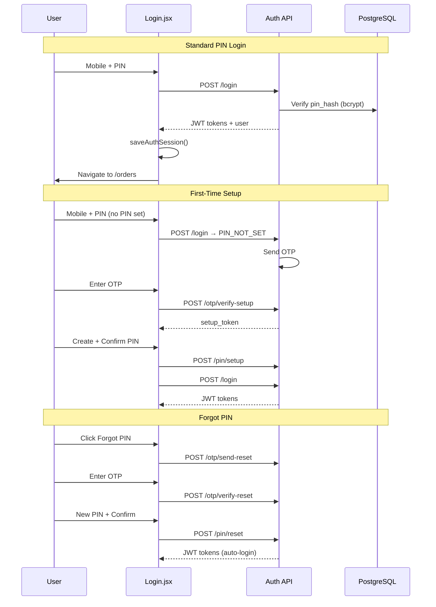

# PIN-Based Authentication Flow

## Overview

The Kitchen Display System uses secure PIN-based authentication with OTP fallback for first-time setup and PIN reset.

## Architecture



## Security Features

| Feature | Implementation |
|---------|----------------|
| PIN storage | bcrypt hash (12 rounds), never stored raw |
| Brute force | 5 failed attempts → 15 min lockout |
| OTP | SHA-256 hashed, 10 min expiry, 5 attempts |
| Sessions | JWT access (15m) + refresh (7d) tokens |
| Rate limiting | 20 auth req / 15 min, 5 OTP req / 15 min |
| Device tracking | Persistent device_id + optional remember device |

## API Endpoints

Base URL: `AUTH_API_BASE` (default: `{API_HOST}/v2.3/common`, override with `REACT_APP_AUTH_API_URL`)

| Endpoint | Method | Purpose |
|----------|--------|---------|
| `/login` | POST | Login with mobile + PIN |
| `/check-mobile` | POST | Check if PIN is configured |
| `/otp/send-setup` | POST | OTP for first-time PIN setup |
| `/otp/send-reset` | POST | OTP for forgot PIN |
| `/otp/verify-setup` | POST | Verify setup OTP |
| `/otp/verify-reset` | POST | Verify reset OTP |
| `/pin/setup` | POST | Create PIN after OTP |
| `/pin/reset` | POST | Reset PIN + auto-login |
| `/token/refresh` | POST | Refresh access token |
| `/logout` | POST | Revoke refresh token |

## Login Request

```json
{
  "mobile": "9876543210",
  "pin": "1234",
  "app_type": "kds",
  "version": "2.2.0",
  "device_id": "DEVICE123",
  "device_model": "web",
  "remember_device": true
}
```

## Success Response

```json
{
  "success": true,
  "message": "Login successful",
  "token": "jwt_access_token",
  "access_token": "jwt_access_token",
  "refresh_token": "jwt_refresh_token",
  "role": "owner",
  "user_id": 1,
  "name": "Admin User",
  "user": { "id": 1, "name": "Admin User", "mobile": "9876543210" }
}
```

## Frontend Storage

Tokens stored in `localStorage` (compatible with existing OrdersList):

- `access_token`, `refresh_token`, `user_id`, `user_role`, `name`, `device_id`

## Local Development

```bash
# Backend
cd server && cp .env.example .env && npm install
psql $DATABASE_URL -f migrations/001_add_pin_auth.sql
npm run dev

# Frontend (point to local auth server)
REACT_APP_AUTH_API_URL=http://localhost:3001/api/auth npm start
```

## Edge Cases

| Scenario | Handling |
|----------|----------|
| Wrong PIN | Error + attempts remaining count |
| Locked account | 423 with locked_until timestamp |
| No PIN set | Redirect to OTP setup flow |
| Expired session | 401 on token refresh → redirect to login |
| No internet | Axios error → user-friendly message |
| PIN mismatch | Validation before API call |
| OTP abuse | Rate limited to 5 requests / 15 min |
